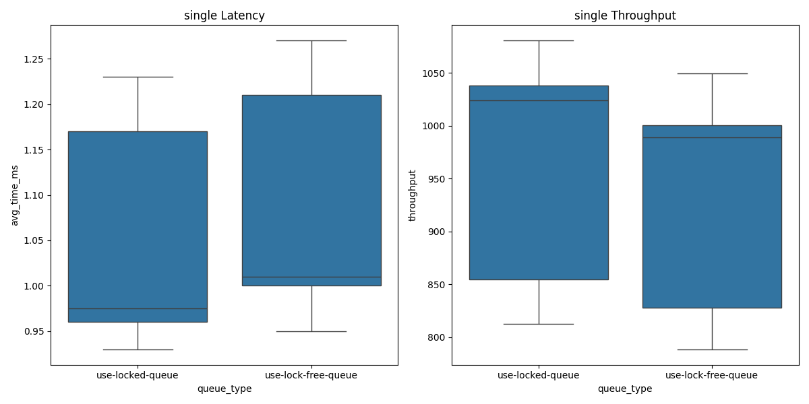

# TiRPC - Tiny RPC Framework

 

参考 [Gooddbird/tinyrpc](https://github.com/Gooddbird/tinyrpc) 实现的轻量级多线程多协程 RPC 框架，有关核心代码的原理请参阅[原作者文章](https://www.zhihu.com/column/c_1515880656429510656)

## 特色功能

- 更好看的 Banner 输出，提示服务器正常运行
- 仿照 SpringBoot 的日志输出格式，日志内容更易理解
- 改正日志重复输出的 bug
- 正确处理 `TcpConnection` 中 `read_hook` 为空的逻辑
- 使用从 `TcpServer` 继承的方式区分 RPC 服务器和 HTTP 服务器，解耦代码
- 完善 `HttpServer`，目前支持通过 GET 请求从服务器正确读取多种文本文件
- Zookeeper 服务注册/服务发现，一致性哈希负载均衡
- 添加无锁队列管理管理协程池和内存池

## 待办列表

- [x] 添加基于 Zookeeper 的服务注册和服务发现（参考 [corpc](https://github.com/LoveBettygirl/corpc.git)）
- [ ] 支持新的 RPC 协议，比如 json（参考 [jrpc](https://github.com/guangqianpeng/jrpc)）
- [ ] 实现基于 Raft 的分布式治理框架（参考 [ACID](https://github.com/zavier-wong/acid/tree/main)）
- [ ] 添加 HTTP 协议常见协议和关键字处理，如对 `HTTP/1.0`/`HTTP/1.1` 的支持以及 `Connection` 种类的判断

## 使用示例

示例代码请见文件夹 `./examples`

### RPC 服务调用

本项目实现了基于 ZooKeeper 的服务注册和服务发现，可同时开启多个服务器来处理请求。由于运行服务器需要不同的端口，可通过命令行来对端口进行设置：

```bash
./rpc_server <config> -p <port>
```


### HTTP 服务器


## 性能测试

### 测试环境

- CPU: Intel Core i5-9300H @ 8x 2.4GHz
- RAM: 15934MiB
- OS: Ubuntu 20.04 jammy(on  the Windows Subsystem for Linux)

### 测试结果

```bash
wrk -c 1000 -t 8 -d 30 --latency 'http://127.0.0.1:19999/qps?id=1'
```

| IO thread | 1000     | 2000     | 5000     | 10000    |
| --------- | -------- | -------- | -------- | -------- |
| 1         | 8529.86  | 8710.45  | 8562.38  | 8809.32  |
| 4         | 38781.26 | 36080.29 | 37408.68 | 36920.82 |
| 16        | 72882.96 | 63116.69 | 64311.55 | 75873.56 |

### 无锁队列效果展示

使用一个 client 进行 1w 次调用测试，重复 30 轮，下图是一个简单的结果展示。整体来说使用 `LockFreeQueue` 反而会降低速度



后续会测试在多个 client 并发的情况下无锁队列的效果

## 参考资料

- [libco](https://github.com/Tencent/libco)
- [tinyrpc](https://github.com/Gooddbird/tinyrpc)
- [sylar](https://github.com/sylar-yin/sylar)
